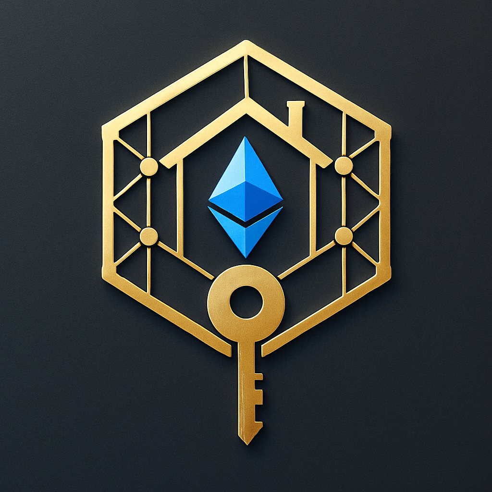

# 🐾 PetProtect — Web3 Pet Insurance Basic Edition (White-Label MVP)

A lean, whitelabel micro-insurance dApp for dogs and cats.  
Buy blockchain-based policies. No paperwork. No middlemen.  
Built on Polygon. Pay in MATIC.

---

## 🚀 Features

- 🐕 Buy pet insurance with just a wallet — no KYC
- 💸 MATIC-based payments with live price support
- 📂 View purchased policies in your "My Coverage" dashboard
- 🖼️ Upload custom images for each policy
- 🧩 Modular code — easily extend with claims or governance
- 💼 White-label friendly: customize brand, text, images
- ⚙️ Deployed on Polygon Amoy testnet (ETH L2)

---

## 🧱 Project Structure

```bash
components/
├── policies/                 # Insurance-related UI (buy, view, coverage grid)
└── shared/                   # Navbar, footer, layout, CTA, wallet button, etc.

pages/
├── index.tsx                 # Homepage (hero + category nav)
├── dashboard.tsx             # User dashboard (policy overview)
├── coverage-exchange.tsx     # Marketplace-style policy plans
├── create-policy.tsx         # Admin or test plan creation
├── my-coverage.tsx           # Purchased policy viewer
├── about.tsx, whats-covered.tsx, why-its-so-affordable.tsx

hooks/
├── useCoverageExchange.ts    # Load static or future dynamic plans
├── useMyPolicies.ts          # Fetch user's purchased policies
└── useUserPolicies.ts        # Load all user-created policies (if needed)

utils/
├── connectWallet.ts
├── loadContract.ts
├── purchasePolicy.ts
└── misc helpers: formatPrice, fetchMaticPrice, etc.
```

---

## ⚙️ Getting Started

### 1️⃣ Clone the Repo

```bash
git clone https://github.com/YOUR_USERNAME/fractionalhq-pet.git
cd fractionalhq-pet
```

### 2️⃣ Install Dependencies

```
npm install
```

### 3️⃣ Set Environment Variables

Create a .env.local file:

```
NEXT_PUBLIC_POLICY_CONTRACT=0xYourContractAddress
NEXT_PUBLIC_CHAIN_ID=80002
NEXT_PUBLIC_RPC_URL=https://polygon-amoy.infura.io/v3/YOUR_INFURA_ID
NEXT_PUBLIC_PINATA_JWT=Bearer YOUR_PINATA_JWT
```

Uses Polygon Amoy Testnet (chain ID 80002).
You can use Pinata or Web3.Storage for IPFS uploads.

### 4️⃣ Run Locally

> 💡 This app is optimized for **MetaMask**. Other wallets may work if they support `window.ethereum`, but MetaMask is officially supported.

```
npm run dev
```

Visit: http://localhost:3000

### 🔐 Smart Contract Info

Contract: PetPolicy.sol

Network: Polygon Amoy Testnet

Use scripts/deployPetPolicy.cjs to deploy

Store contract address in .env.local under NEXT_PUBLIC_POLICY_CONTRACT

### 💼 Licensing & Usage

This repo is a white-label starter kit.
It’s free to use for demo or educational purposes.

For production use, premium modules, or support:

📩 info@fractionalhq.com
🌐 https://fractionalhq.com

### 💡 Want More?

Upgrade to a paid plan and unlock:

✅ submitClaim() flow — users file claims on-chain

🧠 DAO voting on claims (token-based governance)

🧮 Shared claim pool from revenue

📦 Expansion packs: TravelProtect, ElectronicsProtect, HomeProtect

---

### 💼 Feature Comparison

| Feature                    | Free Tier (Demo) | Plus Tier (Pro) | Premium Tier (Claims) |
| -------------------------- | :--------------: | :-------------: | :-------------------: |
| ✅ Buy Standard Plans      |        ✅        |       ✅        |          ✅           |
| 🐶 Enter Pet Name          |        ✅        |       ✅        |          ✅           |
| 🖼️ Upload Custom Pet Image |        ✅        |       ✅        |          ✅           |
| ➕ Create Custom Plans     |        ❌        |       ✅        |          ✅           |
| 📄 Submit Claims           |        ❌        |       ❌        |          ✅           |

> Want to unlock Plan Creation or Claims Submissions?  
> Contact us at **[info@fractionalhq.com](mailto:info@fractionalhq.com)**  
> or visit [fractionalhq.com](https://fractionalhq.com)

### 🧪 MVP Walkthrough (Demo Script)

Visit homepage → click “Dog” or “Cat”

View available policies

Buy coverage using MATIC

Go to Dashboard → see My Coverage

(Optional) Enable Claims or Governance if licensed

### 🧠 Built with ❤️ by FractionalHQ

<p align="center">
  
</p>
No offices. No call centers. Just decentralized insurance.
